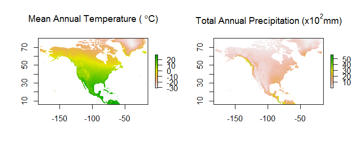
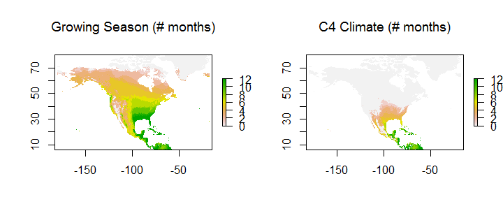
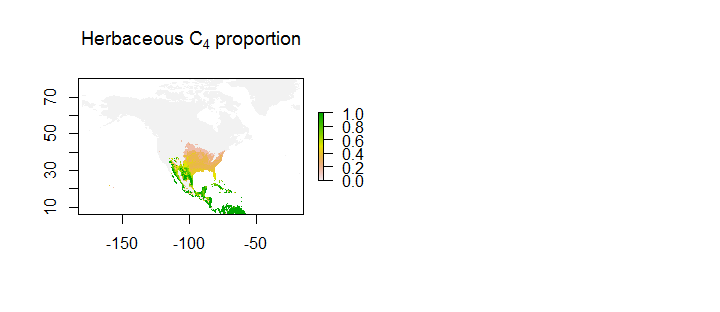
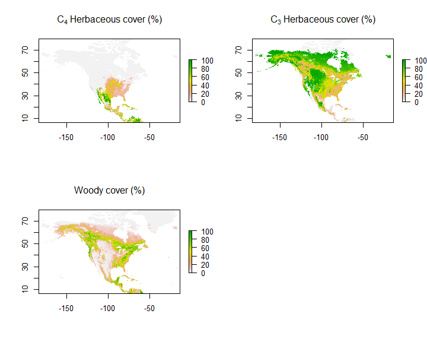
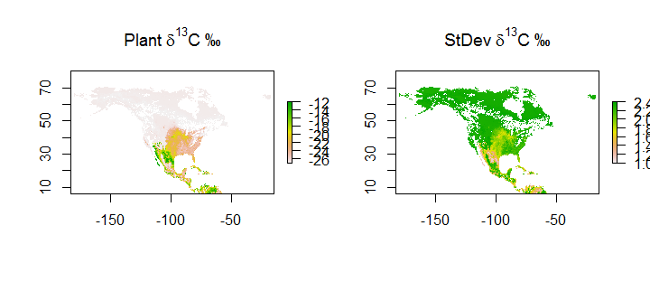

Introduction to grassmapr
================
Daniel M Griffith, Rebecca L Powell, Sydney Firmin, Jen Cotton & Christopher J Still
December 2018

Introduction & Objectives
-------------------------

This vignette serves as an introduction to the grassmapr R package. The workflow that follows also requires learning some basic fuctionality in the raster R package.

Our goal is to predict plant tissue *δ*<sup>13</sup>C variation across a landscape. The primary driver of variation in plant *δ*<sup>13</sup>C is the greater isotopic fractionation in C<sub>3</sub> plants compared to C<sub>4</sub> plants. The crossover temperature model is a physiologically based model that explains the turnover from C<sub>3</sub> to C<sub>4</sub> plants along gradients of temperature (Ehleringer et al. 1997, Collatz et al. 1998, Still et al., 2003).

We will combine the crossover temperature model with data on land cover and climate to produce map of C<sub>3</sub> and C<sub>4</sub> plants in North America. Then, we will apply isotopic endmember values to produce a spatially continuous representation of leaf *δ*<sup>13</sup>C distribution across the land surface. These layers are useful for understanding grass biogeography (e.g., Powell et al. 2012, Griffith et al. 2015) and for studies seeking to identify the movement of animals (e.g., Hobson 1999, Bowen & West 2008).

Load North America example data
-------------------------------

First, Load the required R libraries:

``` r
library(raster)
library(grassmapr)
```

Next, load the spatial datasets that we will use in this example. <br>

``` r
data(temp_NA)     # Mean monthly temperature (deg. C)
data(prec_NA)     # Mean monthly precipitation totals (mm)
data(ndvi_NA)     # Mean monthly NDVI ("greenness")
data(woody_NA)    # Vegetation layer: woody cover (%)
data(cropC3_NA)   # Vegetation layer: C3 crop cover (%)
data(cropC4_NA)   # Vegetation layer: C4 crop cover (%)
```

The rainfall and temperature data are monthly climatologies, so we might want to visualize them as annual means. Based on the crossover temperature model, where would you expect to find C<sub>4</sub> grasses? <br>

``` r
par(mfrow = c(1,2))  
annual_temp <- calc(temp_NA, fun = mean)
plot(annual_temp, 
  main = expression(paste("Mean Annual Temperature (",~degree, "C)", sep = ""))) 

annual_prec <- calc(prec_NA, fun = sum)/100      # rescale to plot
plot(annual_prec, 
  main = expression(paste("Total Annual Precipitation (x10"^2, "mm)", sep = "")))
```

 <br> <br> Before we proceed, we should ensure that all data have the same geographic extent, spatial resolution, and projection. <br>

``` r
compareRaster(temp_NA,
              prec_NA,
              ndvi_NA,
              woody_NA,
              cropC4_NA,
              cropC3_NA)
```

If any of these layers had a different extent or resolution, we could apply the function raster::resample() to make the layers compatible with each other.

A Workflow to produce a C<sub>3</sub> and C<sub>4</sub> distribution map for North America
------------------------------------------------------------------------------------------

First, we will set a C<sub>4</sub> temperature threshold based on the crossover temperature model. Note: In this example we are using mean monthly temperature as our climatic variable, but we could set a threshold based on other temperature variables, such as maximum monthly temperature.

Second, we will set a minimum growing season temperature threshold, as well as a minimum monthly precipitation threshold. The latter screens for locations that have sufficient moisture to support vegetation growth for a given month - that is, we exclude locations that have insufficient precipitation for plant growth for a given month - for example, deserts and Mediterranean climates. <br>

``` r
# Set a C4 temperature threshold based on the COT model (>= 22 deg. C)
C4_temp <- 22
# Set a growing season temperature threshold (>= 5 deg. C)
GS_temp <- 5
# Set a precipitation threshold (>= 25 mm)
GS_prec <- 25
```

Next, we create two stacks of climate mask layers to represent (i) months that favor C<sub>4</sub> plants and (ii) months that meet the growing season (GS) criteria. Note: These masks indicate grid cells to retain for further analysis (classified as 1) and grid cells to exclude (classified as 0). <br>

``` r
# Generate monthly C4 climate masks
C4_masks <- mask_climate(temp.stack = temp_NA,
                         temp.threshold = C4_temp,
                         precip.stack = prec_NA,
                         precip.threshold = GS_prec)

# Generate monthly GS climate masks
GS_masks <- mask_climate(temp.stack = temp_NA,
                         temp.threshold = GS_temp,
                         precip.stack = prec_NA,
                         precip.threshold = GS_prec)
```

We can count the monthly masks to generate an annual representation of the total number of C<sub>4</sub> months and total number of growing season months for each location. <br>

``` r
# Count number of months that satisfy each climate criteria
GS_month_total <- count_months(GS_masks)
C4_month_total <- count_months(C4_masks)
  
par(mfrow = c(1,2))
plot(GS_month_total, 
  main = expression("Growing Season (# months)"), zlim = c(0, 12))
plot(C4_month_total, 
  main = expression("C4 Climate (# months)"), zlim = c(0, 12))
```

 <br> <br> With these two monthly climate masks - and, optionally, monthly NDVI layers - we can calculate the proportion of the herbaceous layer that is C<sub>4</sub> (i.e., the C<sub>4</sub> *potential*). Note: This is different than predicting *actual* vegetation cover. <br>

``` r
# Calculate C4 proportion based on C4 climate only
C4_ratio <- calc_C4_ratio(C4_masks, GS_masks)

# Optionally: Calculate C4 proportion based on C4 climate AND vegetation productivity
C4_ratio_vi <- calc_C4_ratio(C4_masks, GS_masks, veg.index = ndvi_NA)
  
par(mfrow = c(1,2))
plot(C4_ratio, main = expression(paste("Herbaceous C"[4]~"proportion"))) 
```

 <br> <br> To generate representations of *actual* vegetation cover, we can combine the herbaceous C<sub>4</sub> proportion with other vegetation layers such as woody cover and crop cover. *Note: The user must provide any vegetation layers representing * *actual land cover, and these layers must match the geographic extent, spatial * *resolution, and projection of the climate layers.* <br>

``` r
# Create raster stack of other (non-grassy) vegetation layers
veg_layers <- stack(woody_NA, cropC3_NA, cropC4_NA)
  
# Indicate layers that correspond to C4 vegetation
C4_flag <- c(0, 0, 1)

# Indicate layers that correspond to herbaceous vegetation
herb_flag <- c(0, 1, 1)
  
# Calculate plant functional type layers (C4 grass, C3 grass, woody)
pft_cover <- calc_pft_cover(C4.ratio = C4_ratio, 
                            GS.mask = GS_masks, 
                            veg.layers = veg_layers, 
                            C4.flag = C4_flag, 
                            herb.flag = herb_flag)  

par(mfrow = c(2,2))
plot(pft_cover[[1]], 
  main = expression(paste("C"[4]~"Herbaceous cover (%)", sep = "")))
plot(pft_cover[[2]], 
  main = expression(paste("C"[3]~"Herbaceous cover (%)", sep = "")))
plot(pft_cover[[3]], 
  main = expression("Woody cover (%)"))
```



Turning the vegetation map into an isoscape
-------------------------------------------

Finally, we will generate a vegetation stable carbon (*δ*<sup>13</sup>C) isoscape by applying a simple linear mixing model to each grid cell. From the literature, we identify *δ*<sup>13</sup>C endmember values for each plant functional type layer. Isotopic endmembers are weighted by the respective percent vegetation composition of each pixel (in this case, C<sub>4</sub> herbaceous, C<sub>3</sub> herbaceous, C<sub>3</sub> woody).

Note: In this example, we have elected to combine the C<sub>4</sub> and C<sub>3</sub> crop layers with corresponding natural grass layers; however, the functions presented here could be easily adapted for custom plant cover types.

``` r
# d13C endmember vector for PFT layers from the literature
d13C_emb <- c(-12.5, # C4 herb
              -26.7, # C3 herb
              -27.2) # woody

# Apply mixing model to generate d13C isoscape
d13C_iso <- calc_del13C(pft_cover, d13C_emb)

# Standard deviation of d13C endmember means from the literature
d13C_std <- c(1.1, # C4 herb
              2.3, # C3 herb
              2.5) # woody

# Calculate weighted standard deviation of mean d13C values
d13C_iso_std <- calc_del13C(pft_cover, d13C_std)

# Mac Users: substitute "\u2030" for "\211"
par(mfrow = c(1,2))
plot(d13C_iso, main = expression(Plant~{delta}^13*C~"\211"), 
  zlim = c(-27,-12))  
plot(d13C_iso_std, main = expression(StDev~{delta}^13*C~"\211"),
  zlim = c(1.0, 2.4)) 
```

 <br><br>

References
----------

Bowen, G. J. and West, J. B. 2008. Isotope landscapes for terrestrial migration research. -- In: Hobson, K. A. and Wassenaar, L. I. (eds.), Tracking Animal Migration with Stable Isotopes. Academic, pp. 79-105.

Collatz, G. J. et al. 1998. Effects of climate and atmospheric CO<sub>2</sub> partial pressure on the global distribution of C<sub>4</sub> grasses: present, past, and future. -- Oecologia 114: 441-454.

Ehleringer, J. R. et al. 1997. C<sub>4</sub> photosynthesis, atmospheric CO<sub>2</sub>, and climate. -- Oecologia 112: 285-299.

Griffith, D. M. et al. 2015. Biogeographically distinct controls on C<sub>3</sub> and C<sub>4</sub> grass distributions: merging community and physiological ecology. -- Global Ecol. Biogeogr. 24: 304-313.

Hobson, K. A. 1999. Tracing origins and migration of wildlife using stable isotopes: a review. -- Oecologia 120: 314-326.

Kohn, Matthew J. 2010. Carbon isotope compositions of terrestrial C<sub>3</sub> plants as indicators of (paleo) ecology and (paleo) climate. -- Proc. Natl. Acad. Sci. 107: 19691–19695.

Powell, R. L. et al. 2012. Vegetation and soil carbon-13 isoscapes for South America: integrating remote sensing and ecosystem isotope measurements. -- Ecosphere 3: 109.

Still, C. J. et al. 2003. Global distribution of C<sub>3</sub> and C<sub>4</sub> vegetation: carbon cycle implications. -- Global Biogeochem. Cycles 17: 1006.

<br><br><br><br><br><br><br><br><br><br><br><br><br><br><br><br><br><br><br><br><br><br><br><br><br><br><br><br><br><br>
